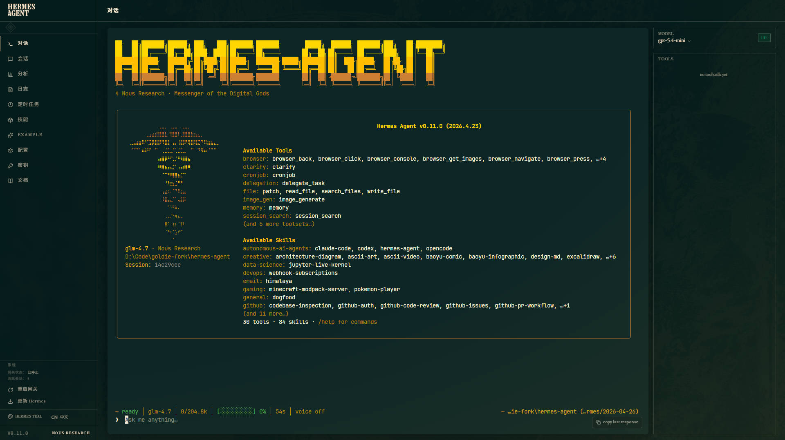

<p align="center">
  
</p>

<p align="center">
  
</p>

# Hermes Agent — Windows 开发版

这是面向 Windows 原生环境的 Hermes Agent 开发版 fork，重点修复 Windows 下的编码、Git Bash 路径、TUI、Dashboard Chat 和多 profile 运行体验。

原始英文 README 已备份至 [README_hermes.md](README_hermes.md)。中文上游说明见 [README.zh-CN.md](README.zh-CN.md)。原始 fork 仓库：https://github.com/carterwayneskhizeine/hermes-agent

## 快速开始

```powershell
git clone https://github.com/carterwayneskhizeine/hermes-agent-windows-R.git
cd hermes-agent-windows-R
uv venv venv --python 3.12
.\venv\Scripts\Activate.ps1
uv pip install -e ".[all,dev]"
hermes model
hermes gateway run
```

需要完整安装说明、Windows 注意事项和多实例配置，请看下面的文档入口。

## 文档入口

| 主题 | 说明 |
|------|------|
| [Windows 文档总览](docs/windows/README.md) | 本 fork 的 Windows 安装、运行和排错文档入口 |
| [Windows 快速安装](docs/windows/quickstart.md) | 环境要求、安装步骤、首次配置、Git Bash 路径、常用命令 |
| [psmux 一键启动](docs/windows/psmux-startup.md) | 安装 `psmux`、使用 `start-hermes.ps1`、给 AI 修改脚本的提示词 |
| [Profile 与多实例](docs/windows/profiles-and-multi-instance.md) | 创建 profile、`-p` 参数、`HERMES_HOME`、多 Gateway / Dashboard 并行运行 |
| [Profile 配置示例](docs/windows/profile-config.md) | 去敏后的 default / belbin / goldie / mem / turing 配置示例 |
| [Dashboard Web UI](docs/windows/dashboard.md) | Dashboard 启动、前端构建、TUI Chat、多 profile 端口 |
| [Windows 特有说明](docs/windows/windows-notes.md) | Git Bash 路径转换、CWD、危险命令拦截、进程管理、适配摘要 |
| [Windows 故障排查](docs/windows/troubleshooting.md) | 常见安装、端口、Web UI、Gateway lock、路径问题 |
| [Windows 适配记录](docs/winodws_support/) | 更完整的移植记录和历史修改说明 |

## 常用命令

```powershell
hermes                  # 启动交互式 CLI
hermes gateway run      # 启动消息 gateway
hermes model            # 切换 LLM 模型
hermes tools            # 管理工具开关
hermes doctor           # 诊断环境问题
```

Dashboard 首次构建前端：

```powershell
cd web
npm install
npm run build
cd ..
```

启动 Dashboard：

```powershell
python -m hermes_cli.main dashboard --no-open --tui
```

浏览器打开：

```text
http://127.0.0.1:9119
```

psmux 一键启动：

```powershell
winget install psmux
.\start-hermes.ps1
```

## 项目说明

Hermes Agent 的核心代码、工具系统、插件系统、Gateway、TUI 和 Web Dashboard 仍保留在仓库根目录及各功能目录中。开发者请优先阅读根目录 [AGENTS.md](AGENTS.md)，其中记录了本仓库的代码结构、插件规则、Windows 注意事项和贡献约束。

如果你只想使用 Windows 版本，从 [Windows 快速安装](docs/windows/quickstart.md) 开始即可。
